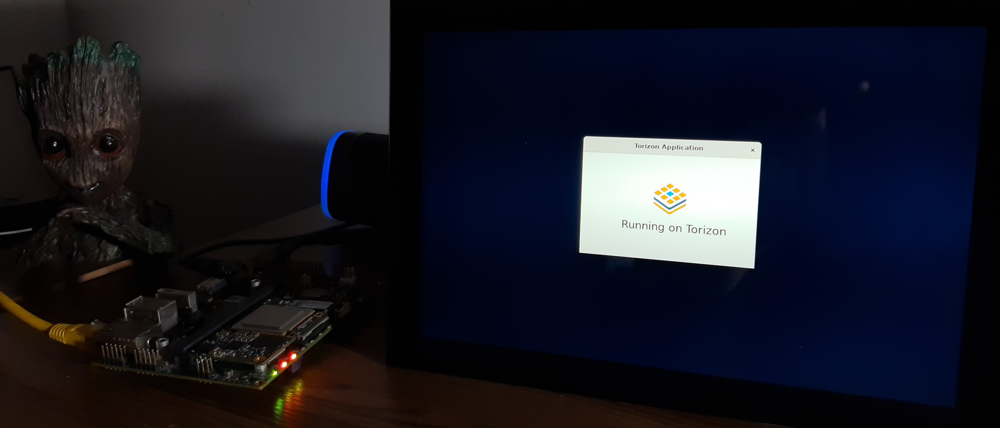

# Running Rust on Torizon

  Rust is a multi-paradigm programming language designed for performance and safety, especially safe concurrency. Rust is syntactically similar to C++, can guarantee memory safety by using a borrow checker to validate references. Rust achieves memory safety without garbage collection, and reference counting is optional. From Pop!_OS by System76 GTK3 desktop applications to nmp(Node Package Manager), Rust is being used on several [production applications](https://www.rust-lang.org/pt-BR/production/users).

## Why to Run Rust on Torizon?

As written on the official [Rust website](https://www.rust-lang.org/), if you are targeting low-resource devices and need low-level control without giving up high-level languages conveniences, then Rust is for you. But, you might be thinking why Rust could be a match for Torizon? So, Rust is well-suited for building **microservices** and that fits perfectly with the proposal of Toradex Easy-to-use Industrial Linux Software Platform.

Torizon uses Docker as it's main engine to run applications, which can help your to easily create and import applications to run inside containers.

## Setup

The application can be deployed to two different architectures, **armv7** and **armv8**:

 - armv8: Apalis iMX8 and the LVDS 10 Inch Display.
 - armv7: Apalis iMX6 and the Capacitive Display.

Both of the setups above were validated using the Ixora Carrier Board. Feel free to choose the architecture, since two different images will be offered.

# Deploying the Application to the Board


In case you just want to see the application running on the module, you can run the [docker-compose](https://github.com/juliobonon/rustarm/blob/master/gtk-rs/docker-compose.yaml) as shown in the gif above, just be aware to replace the `gladearm` image with the respective board architecture:

- armv8: [reininy/gladearmv8](https://hub.docker.com/repository/docker/reininy/gladearmv8)
- arvm7: [reininy/gladearm](https://hub.docker.com/repository/docker/reininy/gladearm)


# Understading the Build and Deploy Process

Now that you saw the application running, let's understand the process of deploying the application to the module. As said before, Rust is a compilled language, in order to run the application on the board we need to cross-compile the binary generated by [cargo](https://doc.rust-lang.org/book/ch01-03-hello-cargo.html) using a multi-stage build image. Take a look at the [Dockerfile](https://github.com/juliobonon/rustarm/blob/master/gtk-rs/Dockerfile):

```
ARG PKG_ARCH=armhf
# For arm64 use:
# ARG PKG_ARCH=armv8
ARG TARGET=armv7-unknown-linux-gnueabihf
# For arm64 use:
# ARG TARGET=aarch64-unknown-linux-gnu
ARG TARGET_IMAGE=arm32v7-debian-wayland-base
# For arm64 use:
# ARG TARGET_IMAGE=arm64v8-debian-weston-vivante:bullseye
FROM debian:bullseye as build

ARG PKG_ARCH
ARG TARGET
ARG TARGET_IMAGE

ENV CARGO_HOME=/cargo
ENV PATH=/cargo/bin:$PATH
ENV PKG_CONFIG_PATH="/usr/lib/arm-linux-gnueabihf/pkgconfig"
ENV PKG_CONFIG_ALLOW_CROSS="true"
ENV CARGO_TARGET_ARMV7_UNKNOWN_LINUX_GNUEABIHF_LINKER="/usr/bin/arm-linux-gnueabihf-gcc"
ENV CARGO_TARGET_AARCH64_UNKNOWN_LINUX_GNU_LINKER="/usr/bin/aarch64-linux-gnu-gcc"
ENV USER=root

RUN dpkg --add-architecture ${PKG_ARCH} && \
    apt-get update && apt-get install -y build-essential cmake libc6-${PKG_ARCH}-cross libc6-dev-${PKG_ARCH}-cross \
    gcc-arm-linux-gnueabihf g++-aarch64-linux-gnu librust-gtk-dev libgtk-3-dev:${PKG_ARCH} pkg-config \
    libdbus-1-dev libdbus-1-dev:${PKG_ARCH} curl

RUN curl --proto '=https' --tlsv1.2 -sSf https://sh.rustup.rs > /usr/local/bin/rustup.sh
RUN bash /usr/local/bin/rustup.sh -y
RUN rustup default stable
RUN rustup target add x86_64-unknown-linux-gnu
RUN rustup target add ${TARGET}

COPY glade/ .
RUN cargo build --target=${TARGET} --release
RUN ls -la

FROM torizon/${TARGET_IMAGE}

ENV DEBIAN_FRONTEND="noninteractive"

RUN apt-get update && apt-get install -y && \
    apt-get install libgtk-3-0

COPY --from=build /target/a*/release/glade /usr/bin/
COPY --from=build imgs/torizon-icon.png /home/torizon/imgs/

CMD /usr/bin/glade
```

You might have notice that there are two stages on the Dockerfile:

1. FROM debian:bullseye as build

The first stage is known to be the SDK, which means that it's responsible for installing all the build-related packages and also setting the environment variables. After setting up the workspace, it compiles the binary.

2. torizon/${TARGET_IMAGE}

The second stage is the application itself, it installs all the runtime dependent packages and copy all the necessary files (in this case, just the binary and the image used by the application) from the first stage. For the final step, it just runs the binary which result on the application running on the module.


